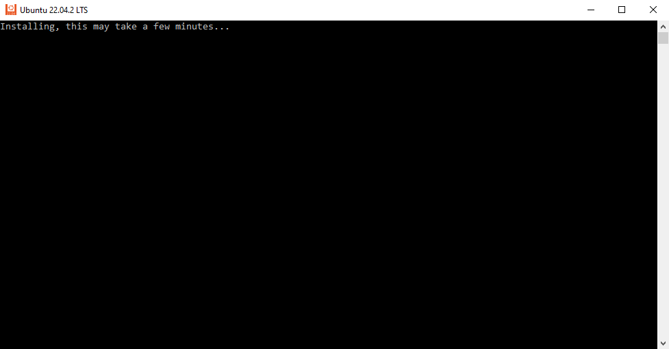
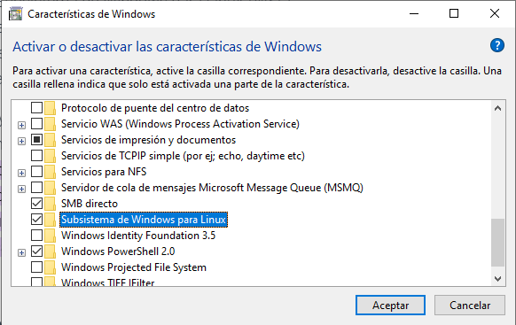
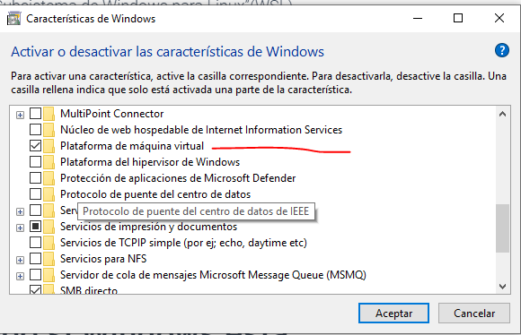

## Instalación de Ubuntu 22

1. Abrir Microsoft Store (Tienda)
2. Buscar Ubuntu 22 -> `Obtener`
3. Abrir y la primera vez tarda un rato en configurar:

---
En caso de que el WSL no este activado abrimos las `Características de Windows` y:
- Marcamos Subsistema de Linux para Windows

- Marcamos plataforma de máquinas virtuales:

4. Aceptar
Para que se habilite la configuración **hay que reiniciar**. [Más info](https://windows.atsit.in/es/6557)
---
## Extensión de WSL para VS Code
Id: ms-vscode-remote.remote-wsl