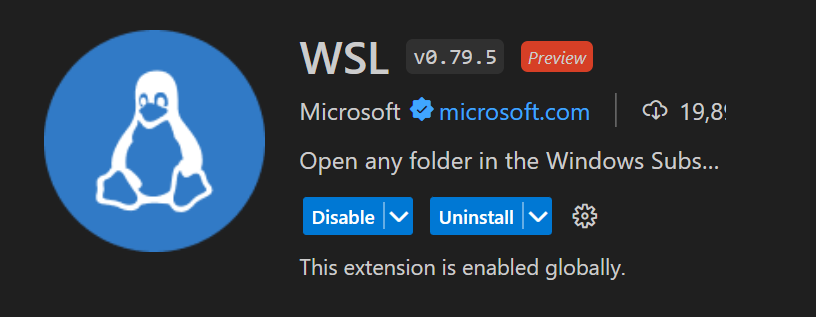
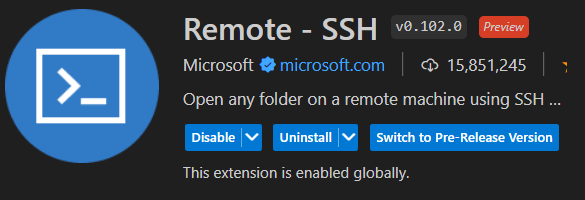
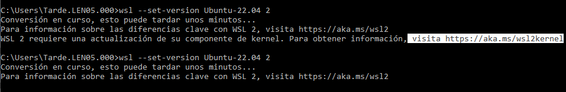

## Instalación de Ubuntu 22

1. Abrir Microsoft Store (Tienda)
2. Buscar Ubuntu 22 -> `Obtener`
3. Abrir y la primera vez tarda un rato en configurar:

---
En caso de que el WSL no este activado abrimos las `Características de Windows` y:
- Marcamos Subsistema de Linux para Windows

- Marcamos plataforma de máquinas virtuales:

4. Aceptar
Para que se habilite la configuración **hay que reiniciar**. [Más info](https://windows.atsit.in/es/6557)
---
## Extensión de WSL para VS Code
Id: `ms-vscode-remote.remote-wsl`

## Remote SSH
Id: `ms-vscode-remote.remote-ssh`

## Cambiar WSL 1 a WSL 2
```
  wsl --set-version Ubuntu-22.04 2
```
Si nos sale el aviso de actualizar kernel, vamos a la [documentación](https://learn.microsoft.com/es-es/windows/wsl/install-manual#step-4---download-the-linux-kernel-update-package) y bajamos la actualización. 



- Volvemos a ejecutar el comando `wsl --set-version Ubuntu-22.04 2`

... tarda minutos en terminar este update ...

Para comprobar que funcionó, cuando termine:
```
wsl -l -v
``` 
[Más información](https://learn.microsoft.com/es-es/windows/wsl/compare-versions)