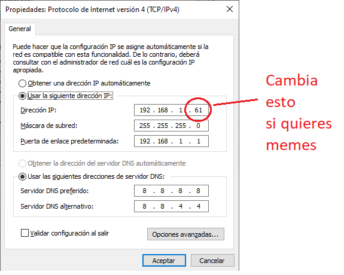

# IFCT0609-CDM
Repositorio de la formación IFCT0609 en CDM

## Módulo 1

### Abril

- HTML y CSS: [Archivos L10 - J13](./1.Modulo_1/abril-10-13/)
- HTML y CSS: [Archivos L17 - J20](./1.Modulo_1/abril-10-13/)
    - [Survey Form](./1.Modulo_1/abril-17-20/survey.html) (1 de 5 Web Responsive Design)

## Módulo 2

## Mayo

- Instalación de XAMPP:
  1. [Descargar XAMPP](https://www.apachefriends.org/es/download.html)
  2. En el instalador, seleccionamos al menos `PHP`, `MySQL` y `Phpmyadmin`
  3. Selecionar carpeta, en Windows suele ser `C://Xampp`
  4. Instalar y abrir programa 
  5. Para iniciar haced click en `Start` para Apache y MySQL. Si aparecen en verde, podemos abrir localhost haciendo click en `Admin`

## Configuración de IP estática

